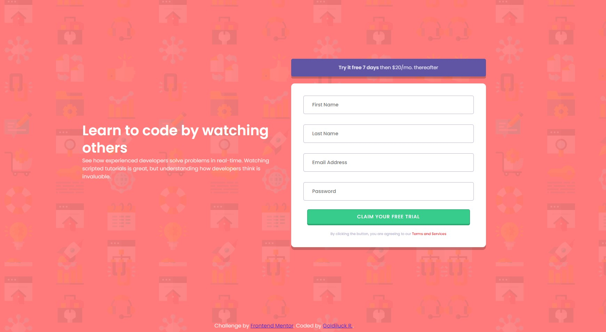
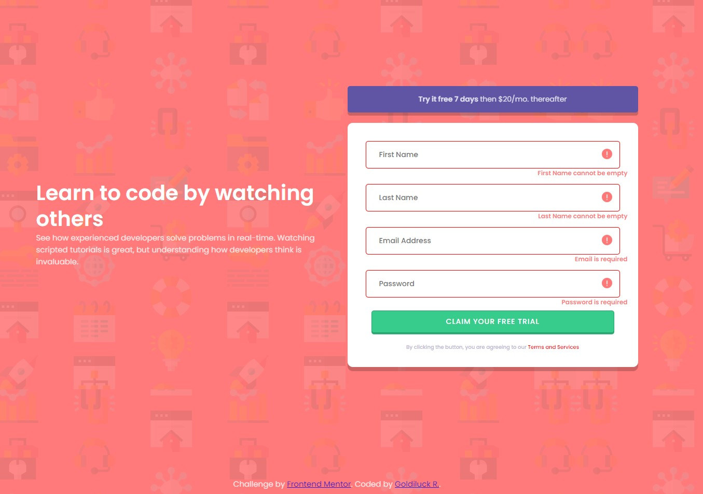
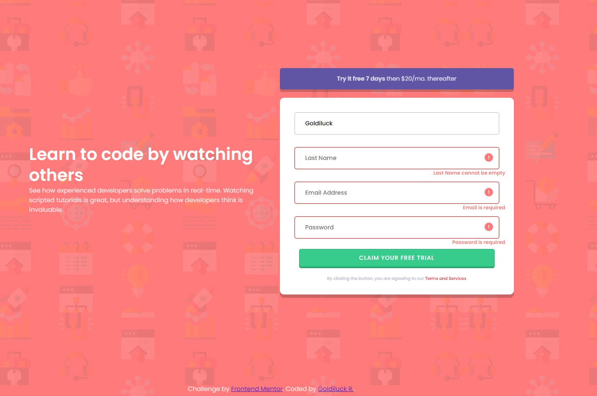
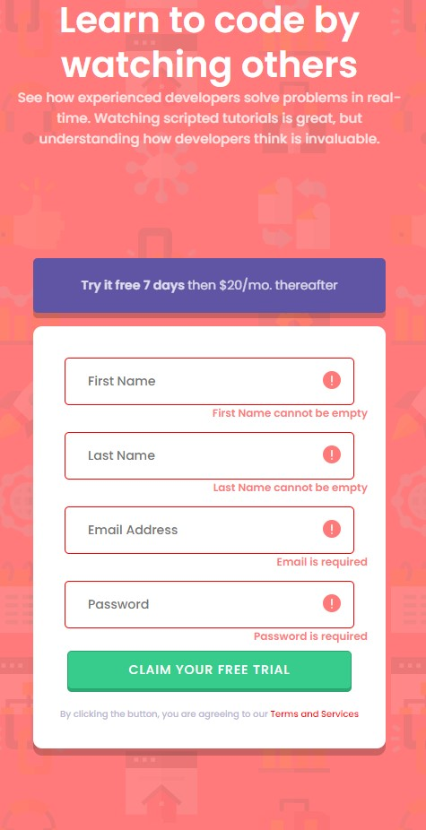

# Frontend Mentor - Intro component with sign up form solution

This is a solution to the [Intro component with sign up form challenge on Frontend Mentor](https://www.frontendmentor.io/challenges/intro-component-with-signup-form-5cf91bd49edda32581d28fd1). 

## Table of contents

- [Overview](#overview)
  - [The challenge](#the-challenge)
  - [Screenshot](#screenshot)
  - [Links](#links)
- [My process](#my-process)
  - [Built with](#built-with)
  - [What I learned](#what-i-learned)
  - [Continued development](#continued-development)
  - [Useful resources](#useful-resources)
- [Author](#author)
- [Acknowledgments](#acknowledgments)
## Overview

### The challenge

Users should be able to:

- View the optimal layout for the site depending on their device's screen size
- See hover states for all interactive elements on the page
- Receive an error message when the `form` is submitted if:
  - Any `input` field is empty. The message for this error should say *"[Field Name] cannot be empty"*
  - The email address is not formatted correctly (i.e. a correct email address should have this structure: `name@host.tld`). The message for this error should say *"Looks like this is not an email"*

### Screenshot

### Links

- Solution URL: [github](https://github.com/goldreb/frontend-mentor-signup/tree/master/intro-component-with-signup-form-master/intro-component-with-signup-form-master)
- Live Site URL: [github](https://goldreb.github.io/frontend-mentor-signup/)

## My process

With Frontend Mentor all the components you need is already given, there is sketch and figma that you can reference to.

I started with the layout in html, then move on the css and adjust the layout in html. I spend most of the time designing the form. Then I did the javascript at the very end. 
Some of the active state was done in CSS, like the border of the from will turn red if there is no input, but it is still tied to the javascript.
When javascript recieves no input then the error will show.

### Built with

- Semantic HTML5 markup
- CSS custom properties
- Flexbox
- CSS Grid
- Mobile-first workflow
-Javascript

### What I learned

- I learned about DOM in javascript
- I learned @media query more
- I learned how to create active state with CSS and javascript

### Continued development

There is still alot to learn, I wanted to more confident in learning different ways to achieve active state in javascript.

## Author

- Github - [goldreb](https://github.com/goldreb)
- Frontend Mentor - [@yourusername](https://www.frontendmentor.io/profile/goldreb)
- Twitter - [@goldspycoder](https://twitter.com/goldspycoder)
